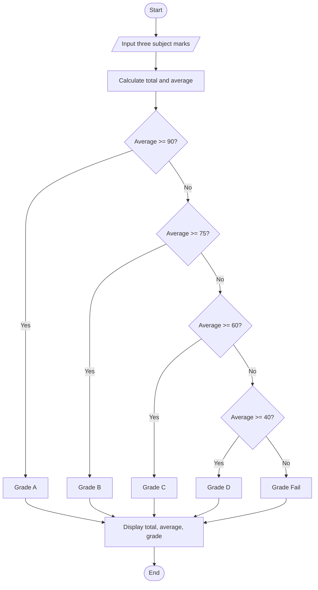

# Flowchart — Student Marks and Grade

Beginner-level flowchart using sequence, decisions, and loops from the Python syllabus.

```mermaid
flowchart TD
 A([Start]) --> B[/Input three subject marks/] --> C[Calculate total and average] --> D{Average >= 90?}
 D -- Yes --> E[Grade A] --> J[Display total, average, grade] --> K([End])
 D -- No --> F{Average >= 75?}
 F -- Yes --> G[Grade B] --> J
 F -- No --> H{Average >= 60?}
 H -- Yes --> I[Grade C] --> J
 H -- No --> L{Average >= 40?}
 L -- Yes --> M[Grade D] --> J
 L -- No --> N[Grade Fail] --> J
```
