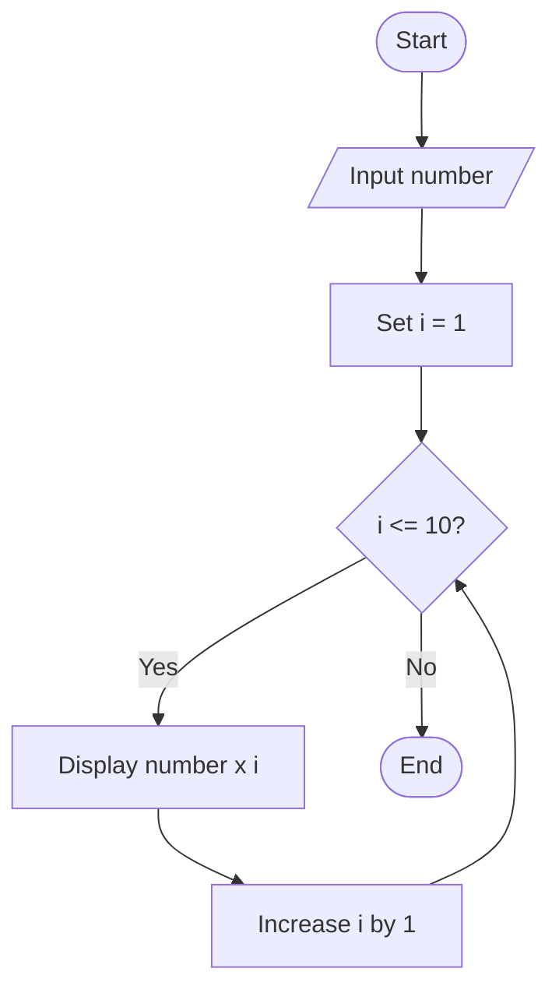

# Flowchart — Multiplication Table

Beginner-level flowchart using sequence, decisions, and loops from the Python syllabus.

```mermaid
flowchart TD
 A([Start]) --> B[/Input number/] --> C[Set i = 1] --> D{i <= 10?}
 D -- Yes --> E[Display number x i] --> F[Increase i by 1] --> D
 D -- No --> G([End])
```
