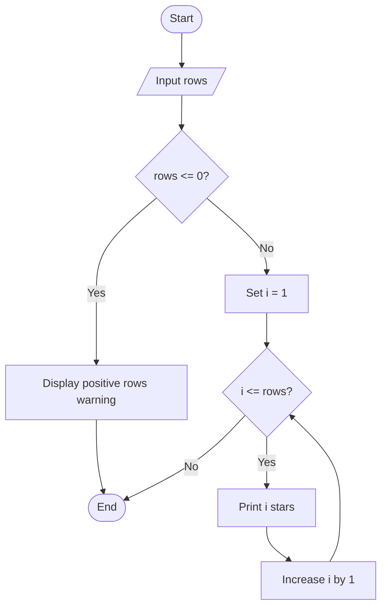

# Flowchart — Star Triangle Pattern

Beginner-level flowchart using sequence, decisions, and loops from the Python syllabus.

```mermaid
flowchart TD
 A([Start]) --> B[/Input rows/] --> C{rows <= 0?}
 C -- Yes --> D[Display positive rows warning] --> G([End])
 C -- No --> E[Set i = 1] --> F{i <= rows?}
 F -- Yes --> H[Print i stars] --> I[Increase i by 1] --> F
 F -- No --> G
```
