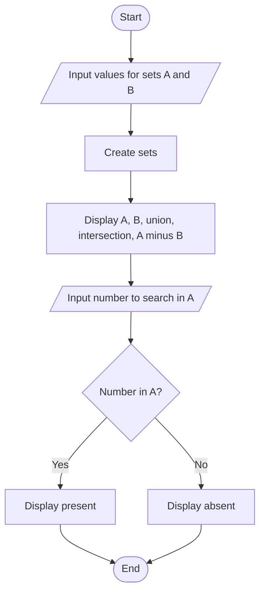

# Flowchart — Set Operations

Beginner-level flowchart using sequence, decisions, and loops from the Python syllabus.

```mermaid
flowchart TD
 A([Start]) --> B[/Input values for sets A and B/] --> C[Create sets] --> D[Display A, B, union, intersection, A minus B] --> E[/Input number to search in A/] --> F{Number in A?}
 F -- Yes --> G[Display present] --> H([End])
 F -- No --> I[Display absent] --> H
```
